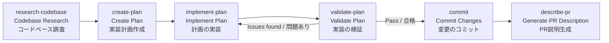
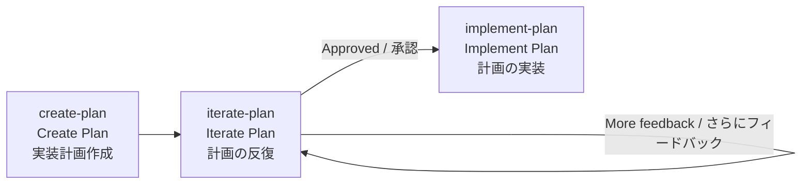
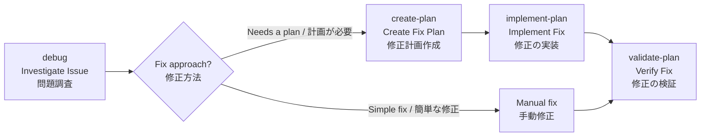
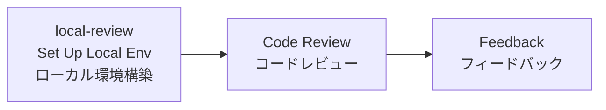

# Copilot CLI Skills / Copilot CLI スキル集

Custom skill definitions for GitHub Copilot CLI. Both English and Japanese (`jp-` prefix) versions are included.

GitHub Copilot CLI 用のカスタムスキル定義です。英語版と日本語版（`jp-` プレフィックス）の両方が含まれています。

## Credits / クレジット

These skills are based on [HumanLayer's](https://github.com/humanlayer/humanlayer) open-source Copilot skill templates. HumanLayer provides a collection of well-designed, production-ready skill definitions for GitHub Copilot CLI.

これらのスキルは [HumanLayer](https://github.com/humanlayer/humanlayer) のオープンソース Copilot スキルテンプレートに基づいています。HumanLayer は GitHub Copilot CLI 向けの設計された実用的なスキル定義のコレクションを提供しています。

---

## Skills / スキル一覧

| Skill | Japanese / 日本語版 | Description / 説明 |
|-------|---------------------|---------------------|
| `commit` | `jp-commit` | Commit changes with user confirmation / 変更のコミット（ユーザー確認あり） |
| `ci-commit` | `jp-ci-commit` | Commit changes automatically (no confirmation) / 変更の自動コミット（確認なし） |
| `create-plan` | `jp-create-plan` | Create implementation plans / 実装計画の作成 |
| `implement-plan` | `jp-implement-plan` | Implement plans phase by phase / 計画のフェーズごと実装 |
| `iterate-plan` | `jp-iterate-plan` | Iterate and refine existing plans / 既存計画の反復・改善 |
| `validate-plan` | `jp-validate-plan` | Validate implementation results / 実装結果の検証 |
| `research-codebase` | `jp-research-codebase` | Research and document the codebase / コードベースの調査・文書化 |
| `debug` | `jp-debug` | Investigate and debug issues / 問題の調査・デバッグ |
| `describe-pr` | `jp-describe-pr` | Auto-generate PR descriptions / PR説明の自動生成 |
| `create-handoff` | `jp-create-handoff` | Create handoff documents / 引き継ぎドキュメントの作成 |
| `local-review` | `jp-local-review` | Set up local review environment with worktrees / worktreeでのローカルレビュー環境構築 |

---

## Workflows / 基本的なワークフロー

Below are typical development workflows combining multiple skills.

以下は、スキルを組み合わせた代表的な開発ワークフローです。

---

### 🔄 New Feature Development / 新機能の開発フロー

```
research-codebase → create-plan → implement-plan → validate-plan → commit → describe-pr
```



**Step-by-step / ステップ解説：**

1. **`research-codebase`** — Research the existing codebase to understand architecture and related components. Findings are saved as a document.
   - まず既存のコードベースを調査し、アーキテクチャや関連コンポーネントを理解する。調査結果はドキュメントとして保存される。

2. **`create-plan`** — Create a detailed, phased implementation plan based on research findings. Refine through interactive dialogue with the user.
   - 調査結果を基に、フェーズ分けされた詳細な実装計画を作成する。ユーザーとの対話を通じて計画を練り上げる。

3. **`implement-plan`** — Implement the approved plan phase by phase. After each phase, run automated verification and pause for manual verification.
   - 承認された計画をフェーズごとに実装する。各フェーズ完了後に自動検証を実行し、手動検証のために一時停止する。

4. **`validate-plan`** — Systematically verify the implementation meets the plan's success criteria. If issues are found, return to `implement-plan` to fix them.
   - 実装が計画の成功基準を満たしているか体系的に検証する。問題があれば `implement-plan` に戻って修正する。

5. **`commit`** — After validation passes, commit changes with appropriate commit messages.
   - 検証合格後、適切なコミットメッセージで変更をコミットする。

6. **`describe-pr`** — Analyze code changes and auto-generate a comprehensive PR description.
   - コード変更を分析し、包括的なPR説明を自動生成する。

---

### 🔁 Plan Iteration / 計画の反復フロー

```
create-plan → iterate-plan → implement-plan
```



When new feedback or information arises after plan creation, use `iterate-plan` to refine the plan before proceeding to implementation.

計画作成後にフィードバックや新しい情報がある場合、`iterate-plan` で計画を改善してから実装に進む。

---

### 🐛 Debugging / デバッグフロー

```
debug → create-plan or manual fix → validate-plan
```



1. **`debug`** — Investigate the root cause of the issue (no code changes are made).
   - 問題の根本原因を調査する（コード変更は行わない）。
2. Implement the fix based on findings.
   - 調査結果に基づいて修正を実装する。
3. **`validate-plan`** — Verify the fix is correct.
   - 修正が正しいか検証する。

---

### 📋 Session Management / セッション管理フロー

```
Working → create-handoff → (new session) → Resume work
```


When you need to pause a long-running task, use `create-handoff` to document progress so work can continue in a new session.

長時間の作業や中断が必要な場合、`create-handoff` で進捗を文書化し、新しいセッションで継続できるようにする。

---

### 👀 Code Review / コードレビューフロー

```
local-review → Review → Feedback
```



Use `local-review` to check out a colleague's branch into a worktree and review their code without disrupting your current work.

同僚のブランチを `local-review` でworktreeにチェックアウトし、現在の作業を中断せずにレビューを行う。

---

### ⚡ CI / Automation / CI・自動化フロー

```
implement-plan → validate-plan → ci-commit
```

In automation pipelines, use `ci-commit` to commit automatically without user confirmation.

自動化パイプラインでは、ユーザー確認なしの `ci-commit` を使用して自動的にコミットする。

---

## Usage / スキルの使い方

Each skill is automatically available within a Copilot CLI session. See the `SKILL.md` file inside each skill folder for detailed instructions.

各スキルは Copilot CLI のセッション内で自動的に利用可能になります。スキルの詳細な説明は各スキルフォルダ内の `SKILL.md` を参照してください。
